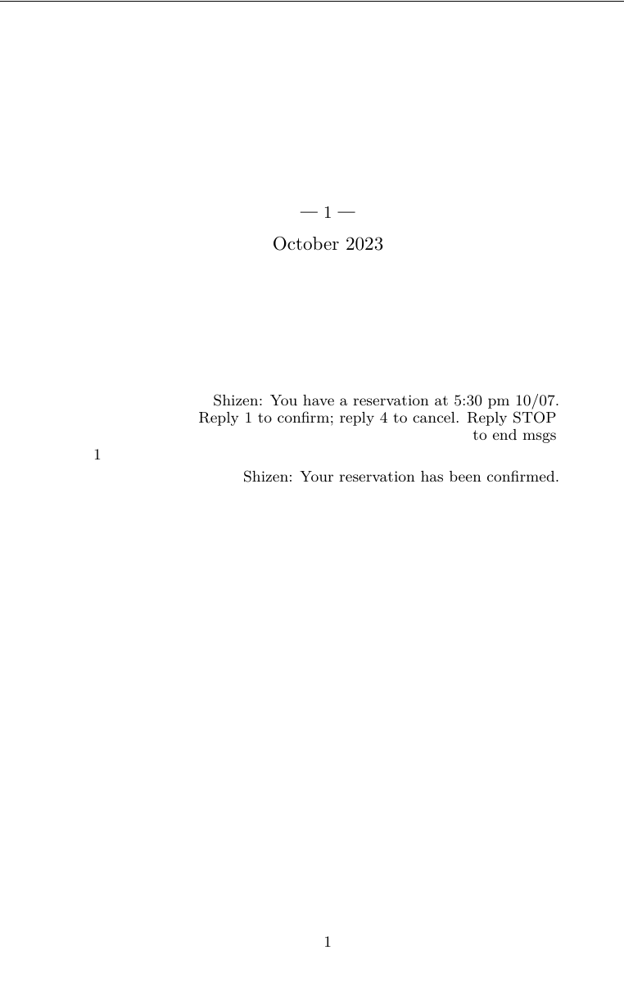
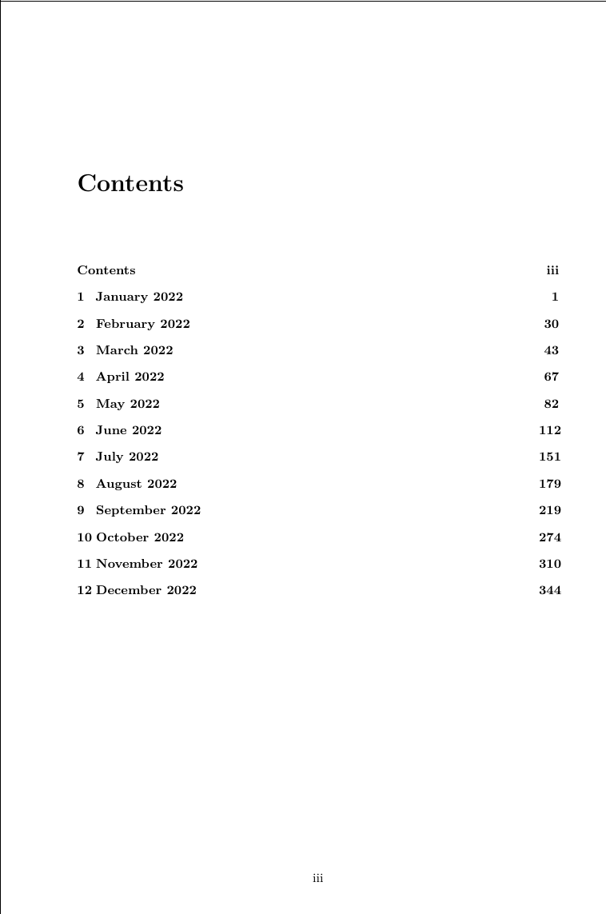

# Instagram Conversation to LaTeX Book Converter 

This tool facilitates the conversion of Instagram conversations into a LaTeX book format. By following these simple steps, you can compile your Instagram dialogues into a readable book format using LaTeX.

The tool is still in works so if you see any bug feel free to open an issue.

## Usage Instructions:

1. **Download Instagram Conversation Data:**
   - Log in to your Instagram account from the website (not the app).
   - Navigate to Settings → Security → [Download Data](https://www.instagram.com/accounts/login/?next=https%3A%2F%2Fwww.instagram.com%2Fdownload%2Frequest%2F%3F__coig_login%3D1) in JSON format (not HTML).
   - Alternatively, you can use this [direct link](https://www.instagram.com/accounts/login/?next=https%3A%2F%2Fwww.instagram.com%2Fdownload%2Frequest%2F%3F__coig_login%3D1) to access the download page.

2. **Select Conversation and Prepare JSON File:**
   - Download the JSON file corresponding to the conversation you wish to convert.
   - Rename the downloaded JSON file to `conv.json`.
   - Move the `conv.json` file to the source directory of the cloned repository.

3. **Run the Tool:**
    To use the tool, clone the repo and run:
     ```
     cargo build
     cargo run
    ```

By following these steps, you'll be able to convert your Instagram conversations into a LaTeX book format seamlessly. Enjoy creating your personalized Instagram dialogue books! If you encounter any issues or have suggestions for improvement, feel free to reach out. Happy converting!



